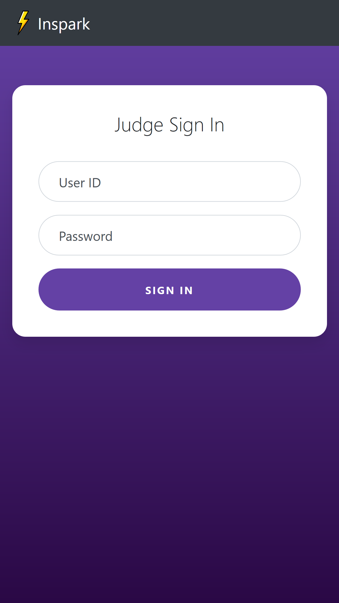
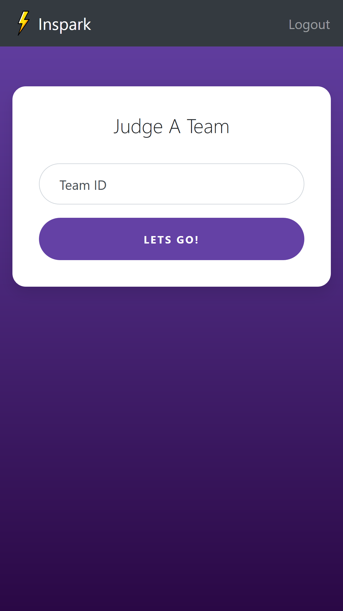
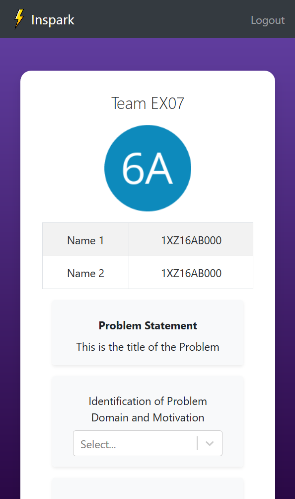

# Inspark PWA

This is the PWA (Progressive Web App) for Judge scoring, feedback collection, evaluation and leaderboarding for Inspark 2019, a project exhibition cum competition held in the IS Department of NMIT. Created with ReactJS with Firebase as the store

## Screenshots

  
  &nbsp
  
  &nbsp
  

## Demo

[Here](https://inspark-is.web.app) is a demo of this webapp hosted on Firebase
